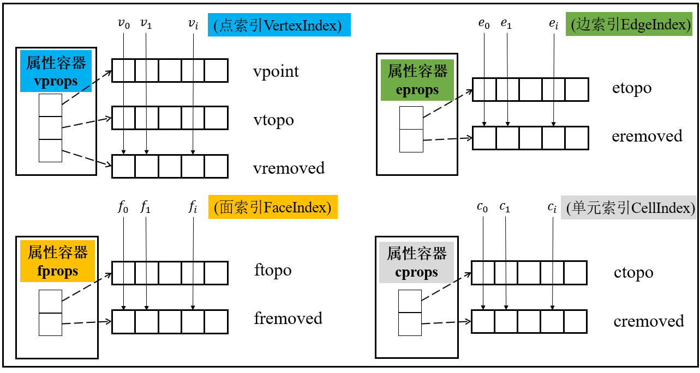
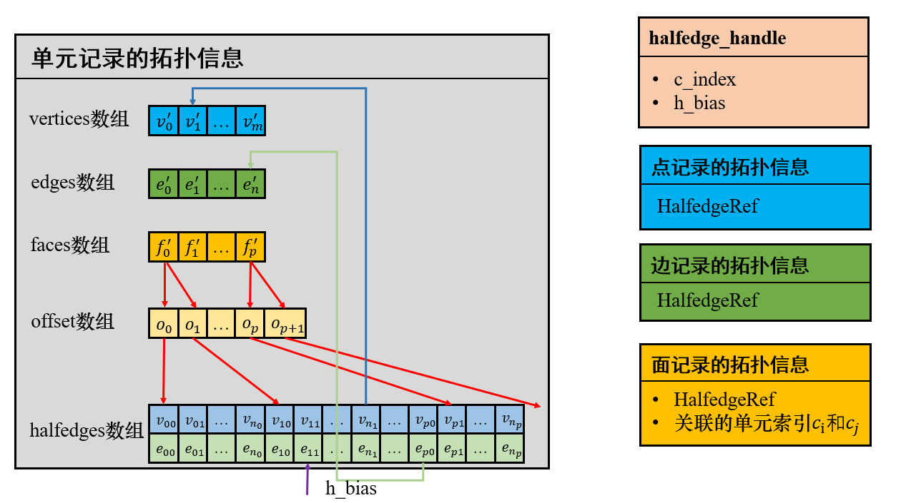

# PTCut

PTCut is a computational geometric algorithm that implemented in C++. It can compute Boolean Operations on surface and polyhedral mesh in a robust and efficient manner.

### 1. Highlight

Mesh Booleans are an essential tool to create and edit digital shapes among geometry processing tasks. However, Booleans on two surface mesh, surface mesh and tetrahedral grid, surface mesh and hexahedral grid form the predominant part of current methods. We present a novel method to compute Boolean operations on surface and polyhedral mesh.

* Innovate polyhedral mesh data structure. I adopt an index and array-based framework to manage mesh elements and its properties in a unified and dynamic way. As for local incidence information encoding, it record incident vertices, edges, faces and halfedges for each cell. For each vertex, edge and face, it store information refer to one of its incident halfedge. By this way, I accomplish abundant interfaces required in algorithm, such as topological query and modification, which have a low computational cost and memory footprint.





* New method to compute Boolean Operations on surface and polyhedral mesh. Firstly, it correctly identify intersecting elements in the input, compute intersection points and lines. Then, it incorporate intersection points and lines into mesh faces, subdivide them into a set of triangles. Finally, each mesh element is deemed as being inside or outside each input object, the result is extracted from mesh elements generated in the above step. Robustness is guaranteed by representing coordinates by rational numbers along with introducing arithmetic filtering. High performance is achieved by recording necessary intermediate data to avoid expensive search and increasing efficiency of topological query and modification.


### 2. How to compile on Windows

* Download thrid party.
  * CGAL: 5.5.2
  * boost: 1.81.0
* Set Environment Variable `$(CGAL_DIR)` and `$(BOOST_INCLUDEDIR)`
* generate `.exe` and calling it like below:

```
./PTCut.exe <polyhedral_mesh_root_dir> <surface_mesh_file_path> <output_dir>
```

### 3. TODO

To be honest, there are a lot of work to do:

* Uniformed file format, just as `.off/.obj/.vtk`.
* Handle coplanar case.
* Fix bug in compute intersection points.
* Don't rely on CGAL and boost, maybe develop tiny containers, geometric predicates, and so on.
* Maybe introduce winding number in class `OutputBuilder`.
* GUI, maybe use imgui instead of Qt.
* ........（to be continue）
